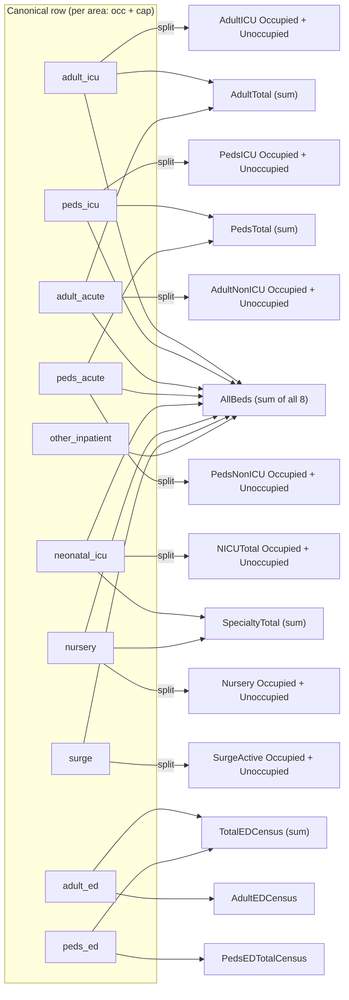

# wahealth-csv-to-safr-fhir

Converts WA Health hospital bed capacity CSVs to FHIR R4 **SAFR Bed Capacity MeasureReport Bundles**, conforming to the [US SAFR Implementation Guide](https://hl7.org/fhir/us/safr) for structural profiles and the [CDC NHSN SAFR Content IG](https://safr-ci.nhsnlink.org) for Measure definitions.

Requires Python 3 (stdlib only — no pip install needed).

## Quick start

```bash
# 1. Create your config
cp config.example.json config.json
# Edit config.json with your hospital's NHSN Org ID, name, address, phone,
# location, and (optionally) FHIR server credentials.

# 2. Run the converter
python3 convert.py input.csv
```

## Usage

```
python3 convert.py input.csv [--config config.json] [--output-dir ./output] [--fhir-server URL] [--bundles-mrs-only] [--fuzz [--fuzz-seed N] [--fuzz-magnitude M]]
```

| Flag | Default | Description |
|---|---|---|
| `csv_file` | *(required)* | Path to the input CSV file |
| `--config` | `config.json` | Path to configuration file |
| `--output-dir` | `./output` | Directory for generated JSON files |
| `--fhir-server` | *(none)* | FHIR server base URL (e.g. `http://localhost:8080/fhir`) |
| `--bundles-mrs-only` | *(off)* | Write only the Bundle and `MeasureReport.json` for each facility; skip the rarely-changing `Organization.json`, `Device.json`, `Location.json`. Affects local files only — `--fhir-server` persistence is unchanged. |
| `--fuzz` | *(off)* | Obfuscate counts: replace the real bed/ED counts with realistic but **fake** values. See [Count fuzzing](#count-fuzzing). |
| `--fuzz-seed` | *(random)* | Integer seed for reproducible fuzzing (e.g. `42`). Any value works; omit for a random, non-reproducible run. Only used with `--fuzz`. |
| `--fuzz-magnitude` | `0.15` | Max proportional perturbation per count, range `(0, 1]` (`0.15` = ±15%; suggested `0.05`–`0.25`). Only used with `--fuzz`. |

The input CSV layout is **auto-detected from its header row** — see [Input CSV formats](#input-csv-formats). An unrecognized header is a hard error: the converter exits without writing any output.

## Count fuzzing

> ⚠️ **Fuzzed output is not real data.** When `--fuzz` is on, the converter logs a prominent
> WARNING. Never submit fuzzed output as an authentic report.

`--fuzz` replaces the real bed-occupancy/capacity and emergency-department counts with
**plausible but fake** numbers during FHIR generation, so output can be shared or demoed
without exposing a facility's true operational data. It is **off by default** — output is
unchanged unless you opt in.

Input is consumed exactly as normal; only the counts are perturbed, and the result stays
realistic:

- every count is a non-negative integer,
- occupied never exceeds capacity (when the source data was consistent),
- aggregates (all beds, adult/peds/specialty totals, total ED) still equal the sum of their
  fuzzed parts — no contradictory numbers,
- only count values change; resource structure, codes, references, dates, and facility data
  are untouched.

Each count is perturbed by up to ±`--fuzz-magnitude` (default ±15%); very small counts get a
small absolute jitter so they are still obfuscated, and a true `0` stays `0`. Pass a fixed
`--fuzz-seed` to reproduce the same fuzzed numbers across runs (useful for stable demos and
tests); omit it for a one-off, non-reproducible run.

```bash
# Real output (default)
python3 convert.py input.csv --config config.json --output-dir output

# Fuzzed, reproducible
python3 convert.py input.csv --config config.json --output-dir output --fuzz --fuzz-seed 42

# Fuzzed, wider spread, non-reproducible
python3 convert.py input.csv --config config.json --output-dir output --fuzz --fuzz-magnitude 0.25
```

## Output

For each data row the script produces:

- **Bundle** — `{output-dir}/{date}/{facility_name}.{date}.BedCapacity.json`
- **Individual resources** — `Organization.json`, `Device.json`, `MeasureReport.json`, `Location.json` in a per-facility subdirectory `{output-dir}/{date}/{facility_name}/` (useful for debugging)

Output is organized first by reporting date, then by facility: `{output-dir}/{date}/` holds the Bundle file(s) for that date and one subdirectory per facility, and `{output-dir}/{date}/{facility_name}/` holds that facility's individual resources. A multi-facility input file produces one Bundle per (facility, reporting date) row; Bundle filenames stay unambiguous because both the facility name and the date are in the name, and each facility's individual resources are isolated in its own subdirectory (so processing a multi-facility file never overwrites one facility's individual resources with another's).

With `--bundles-mrs-only`, only the Bundle file(s) and each facility's `MeasureReport.json` are written; the rarely-changing `Organization.json`, `Device.json`, and `Location.json` files are skipped. This affects local files only — what gets persisted with `--fhir-server` is unchanged.

## FHIR server persistence

With `--fhir-server` (or `server.base_url` in config), the script also persists resources directly to a FHIR server using **upsert semantics** (create on first run, update on subsequent runs). Resources persisted:

- Organization (by NHSN identifier — or the placeholder identifier for an unconfigured facility, see below)
- Location (by facility identifier)
- Device (by software identifier)
- MeasureReport (by measure + subject + date)
- Bundle (by deterministic UUID derived from `facility_guid` — or, when the format has no GUID, the slugified facility name — plus the date)

The Device is upserted once per run. Organization and Location are upserted once per distinct facility (a multi-facility input file can carry several).

### Authentication

If `server.token_endpoint`, `server.client_id`, and `server.client_secret` are set in `config.json`, the script performs an OAuth2 client-credentials grant to obtain a Bearer token before making FHIR requests.

## Configuration

Copy `config.example.json` to `config.json` and fill in:

```jsonc
{
  "organization": {
    "nhsn_org_id": "YOUR_NHSN_ORG_ID",
    "name": "Your Hospital Name",
    "phone": "+1-555-000-0000",
    "address": { "line": [...], "city": "...", "state": "WA", "postalCode": "...", "country": "USA" }
  },
  "location": {
    "identifier_system": "http://example.org/fhir/location-identifier",
    "identifier_value": "FACILITY-ID",
    "name": "Your Hospital Main Campus",
    "description": "Main hospital campus"
  },
  "software": {
    "name": "safr-csv-fhir",
    "version": "1.0.0",
    "identifier_system": "http://example.org/fhir/device-identifier",
    "identifier_value": "safr-csv-fhir"
  },
  "facilities": {       // optional — per-facility identity for multi-facility input files
    "Some Hospital Name": {   // key = the exact value in the CSV's facility column
      "organization": { "nhsn_org_id": "...", "name": "Some Hospital Name", "phone": "...",
                        "address": { "line": [...], "city": "...", "state": "WA", "postalCode": "...", "country": "USA" } },
      "location":     { "identifier_system": "...", "identifier_value": "...",
                        "name": "Some Hospital Name", "description": "..." }
    }
    // ... one entry per known facility
  },
  "server": {           // optional — omit or leave empty to skip server persistence
    "base_url": "",
    "token_endpoint": "",
    "client_id": "",
    "client_secret": ""
  }
}
```

For a **single-facility** input layout (the original WA Health format and the 2026-04-30 WA Health dictionary), the top-level `organization`/`location` describe the submitting hospital and the `facilities` registry is not consulted (the CSV's facility name only affects the output filename).

For a **multi-facility** layout (the KC multi-hospital format), each row's identity is resolved from `facilities[<that row's facility name>]`. If a facility is **not** in the registry (or no `facilities` section is configured), the converter still emits that row's Bundle, but with a **sparsely-populated** Organization and Location built from the CSV row alone and a deterministic *placeholder* NHSN OrgID — `https://www.cdc.gov/nhsn/OrgID | UNREGISTERED-<slugified-facility-name>` — and logs a `WARNING`. These Bundles are structurally valid (they pass FHIR validation), just under-populated; add a `facilities` entry to fill them in. The top-level `organization`/`location` are **not** borrowed for an unconfigured facility (they describe a different specific hospital).

## Logging

Each run creates a timestamped log file in the `log/` directory (`convert_YYYYMMDD_HHMMSS.log`). The same output is mirrored to the console. Logs capture file generation events and FHIR server interactions (successes and errors) for post-run review.

## FHIR profiles used

| Resource | Profile | Source IG |
|---|---|---|
| Bundle | `us-safr-measurereport-bundle` | US SAFR |
| MeasureReport | `indv-measurereport-deqm` (DEQM) | DaVinci DEQM |
| MeasureReport.measure | `BedCapacityMeasure` | NHSN SAFR Content IG |
| Organization | `us-safr-submitting-organization`, `qicore-organization` | US SAFR / QI-Core |
| Location | `qicore-location` | QI-Core |
| Device | `crmi-softwaresystemdevice` | CRMI |

## FHIR Implementation Guides

This project targets two independently versioned FHIR Implementation Guides:

| IG Name | Package ID | Publication URL | Provides |
|---|---|---|---|
| US SAFR (base) | `hl7.fhir.us.safr` | https://hl7.org/fhir/us/safr | Structural profiles for Bundle, MeasureReport, and Organization |
| CDC NHSN SAFR (content) | `gov.cdc.nhsn.safr` | https://safr-ci.nhsnlink.org | Computable Measure definitions (BedCapacityMeasure, HRDMeasure), CodeSystems, and CapabilityStatements |

The Content IG depends on the base IG. The base IG defines *how* resources are shaped; the Content IG defines *what* is being measured.

> **Note:** The Content IG package (`gov.cdc.nhsn.safr`) is not yet published to the standard FHIR package registries. The FHIR validator references it via its publication URL.

### Version tracking

The converter tracks two independent IG version constants in `convert.py`:

- `SAFR_IG_VERSION` — the target version of the base US SAFR IG (`hl7.fhir.us.safr`)
- `NHSN_SAFR_IG_VERSION` — the target version of the CDC NHSN SAFR Content IG (`gov.cdc.nhsn.safr`)

These are independently versioned. Updating either constant is a deliberate, reviewable change that triggers a full FHIR validation pass before merge.

## Input CSV formats

The converter detects which of three hospital CSV layouts a file uses by inspecting its header row, then normalizes every row to one internal model before generating FHIR — so detection/parsing is the only format-aware code (in `csv_formats.py`); everything downstream is format-agnostic.

| If the header contains… | …it's treated as | Notes |
|---|---|---|
| `facility_guid` **and** `reporting_date` | **Original WA Health format** | one facility per file; `reporting_date` is `MM/DD/YYYY`; ~35 HRD columns present in the file are ignored |
| `facility` **and** `reportingday` | **2026-04-30 WA Health dictionary from KC** | one facility per file; ISO `YYYY-MM-DD` dates; `covid_*`/`flu_*`/`rsv_*` and the `all_inpatient_*` totals are ignored (aggregates are recomputed from the per-area columns) |
| `Facility` **and** `Reporting Date` | **KC multi-hospital from MFT 2026-05-11** | Title Case headers; **many facilities and dates per file**; ISO dates; no HRD columns; per-facility identity comes from `config.json`'s `facilities` registry (see [Configuration](#configuration)) |

A file whose header matches none of these is rejected with an error listing the supported formats. In particular, the data-dictionary spreadsheet `WA-HEALTH-DataDictionary.Variable Catalog.KC.2026-04-30.csv` is a *schema reference* (its rows define column names) — it is not a data file the converter ingests. The per-format column maps are documented in `specs/008-multi-format-csv-input/contracts/input-formats.md`.

Whichever format is used, the converter processes the same data:

- **Bed areas** (occupied + capacity, per area): ICU (adult, pediatric), Acute/Non-ICU (adult, pediatric), NICU, Nursery, Surge/Overflow, Other Inpatient
- **ED visits:** previous-day Adult and Pediatric emergency department visits
- **Computed aggregates:** AllBeds, AdultTotal, PedsTotal, SpecialtyTotal (each with occupied + unoccupied counts), plus the three ED census groups — 25 MeasureReport groups in all

HRD / respiratory-disease counts (COVID, influenza, RSV) appear in two of the formats but are **not** processed by this tool (the SAFR `HRDMeasure` is a separate, future scope). When a format has no `facility_guid`, the converter derives a stable identifier from the facility name + reporting date for the deterministic Bundle identifier and FHIR-server upsert key.

## Metric mapping (canonical row → FHIR MeasureReport groups)

After format detection (`csv_formats.py`), every input row — whatever its source layout — becomes one **canonical row** carrying, per bed area, an `{area}_occ` (occupied) and `{area}_cap` (capacity) integer, plus `adult_ed` / `peds_ed`. (How each format's columns map onto those canonical fields is **Stage A**, documented in [`specs/008-multi-format-csv-input/contracts/input-formats.md`](specs/008-multi-format-csv-input/contracts/input-formats.md).) This section covers **Stage B**: how that canonical row becomes the **25 MeasureReport groups**, defined in `convert.py` (`LOINC_CODES`, `BED_MAPPINGS`, and `compute_groups()`).

Two relationship patterns drive Stage B:

- **One-to-many (split):** each bed area carries only *occupied* and *capacity*, but emits **two** groups. Unoccupied is derived, never read from the CSV:
  `unoccupied = max(0, capacity − occupied)` (clamped at 0, so an inconsistent row can't produce a negative count).
- **Many-to-one (aggregate):** several canonical areas are summed into a single higher-level group. Aggregates are always **recomputed from the per-area values** — any precomputed total in the source CSV (e.g. `all_inpatient_*`) is ignored, so totals can't contradict their parts.



### Direct bed-area groups — one-to-many (7 areas → 14 groups)

Each row below is one canonical area producing an *occupied* and an *unoccupied* group (`BED_MAPPINGS` + `LOINC_CODES`):

| Canonical area | Occupied group (LOINC) | Unoccupied group (LOINC) |
|---|---|---|
| `adult_icu` | Adult ICU Census — `112575-6` | Adult ICU Unoccupied — `112574-9` |
| `peds_icu` | Peds ICU Census — `112562-4` | Peds ICU Unoccupied — `112561-6` |
| `adult_acute` | Adult Non-ICU Census — `112572-3` | Adult Non-ICU Unoccupied — `112571-5` |
| `peds_acute` | Peds Non-ICU Census — `112559-0` | Peds Non-ICU Unoccupied — `112558-2` |
| `neonatal_icu` | NICU Total Census — `112545-9` | NICU Total Unoccupied — `112544-2` |
| `nursery` | Nursery Census — `112535-0` | Nursery Unoccupied — `112534-3` |
| `surge` | Surge Total Active Census — `112525-1` | Surge Total Active Unoccupied — `112524-4` |

> `other_inpatient` carries `occ`/`cap` too, but has **no direct group** — it contributes only to the `AllBeds` aggregate below.

### Computed aggregates — many-to-one (→ 8 groups)

Each aggregate sums the occupied (and, separately, the derived unoccupied) values of its inputs:

| Aggregate group | Inputs summed | Occupied group (LOINC) | Unoccupied group (LOINC) |
|---|---|---|---|
| AllBeds | **all 8** areas (incl. `other_inpatient`) | All Beds Census — `112579-8` | All Beds Unoccupied — `112578-0` |
| AdultTotal | `adult_icu` + `adult_acute` | Adult Total Census — `112577-2` | Adult Total Unoccupied — `112576-4` |
| PedsTotal | `peds_icu` + `peds_acute` | Peds Total Census — `112564-0` | Peds Total Unoccupied — `112563-2` |
| SpecialtyTotal | `neonatal_icu` + `nursery` | Specialty Total Census — `112551-7` | Specialty Total Unoccupied — `112550-9` |

### ED groups (→ 3 groups)

ED metrics are census counts only (no capacity, so no unoccupied); the total is a many-to-one sum:

| ED group | Source | LOINC |
|---|---|---|
| AdultEDCensus | `adult_ed` | `112512-9` |
| PedsEDTotalCensus | `peds_ed` | `112510-3` |
| TotalEDCensus | `adult_ed` + `peds_ed` | `112508-7` |

**Total: 14 direct + 8 aggregate + 3 ED = 25 MeasureReport groups per row.**
